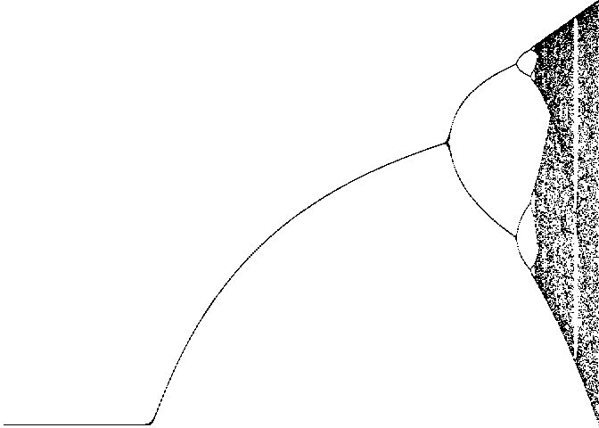
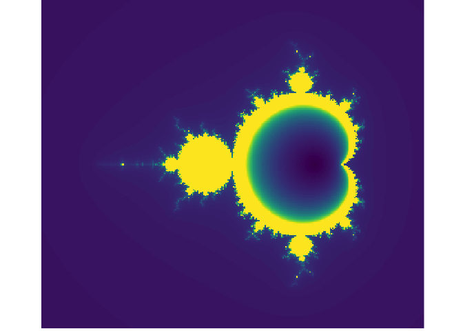

chaos package
================

A package with functions to generate fractals. It is intended to be use
for educational purposes.

## Install

To install `chaos`:

    devtools::install_github("ddiez/chaos")

## Usage

Plot the logitic map.

``` r
library(chaos)

x <- logmap()
plot_logmap(x)
```

<!-- -->

Plot the mandelbrot set.

``` r
z <- mandelbrot(steps = 300)
plot_mandelbrot(z)
```

<!-- -->
