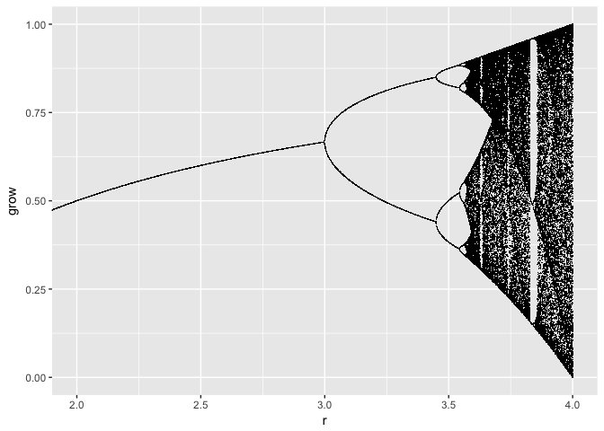

chaos package
================

A package with functions to generate fractals. It is intended to be use for educational purposes.

Install
-------

To install `chaos`:

    devtools::install_github("ddiez/chaos")

Usage
-----

``` r
library(chaos)
```

    ## Loading required package: ggplot2

``` r
x <- logistic_map(rstep = 1e-3)
plot(x, xlim = c(2, 4))
```


